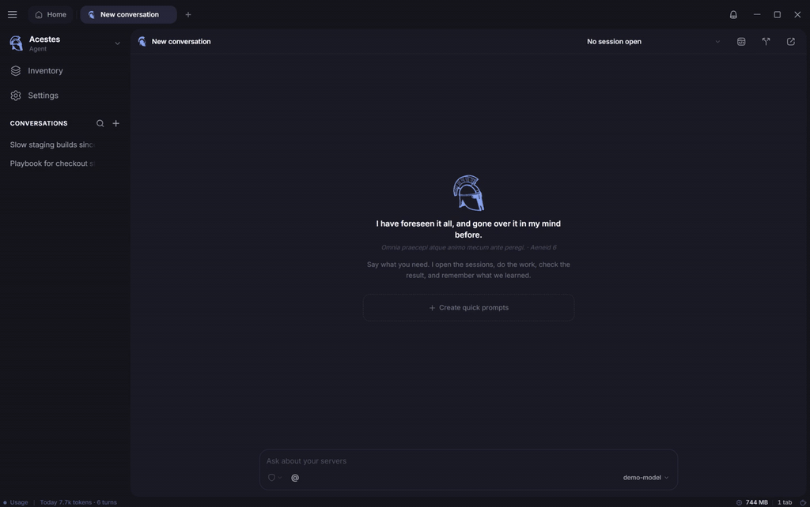

<p align="center">
  
</p>

<h1 align="center">Acestes Agent</h1>

<p align="center">
  <strong>The agent that lives on your desktop and does real work: code, servers, anything IT.</strong>
</p>

<p align="center">
  Persistent memory · Its own inventory · Works on your code and your servers · Runs on the coding agent you already use
</p>

<p align="center">
  <a href="https://github.com/BradPerbs/acestes-agent/releases/latest"><strong>Download for Windows, macOS and Linux</strong></a>
</p>

<p align="center">
  <a href="docs/demo.mp4"></a>
  <br>
  <sub>A sample project and sample inventory. <a href="docs/demo.mp4">Watch it as video</a>.</sub>
</p>

---

## Meet Acestes

Acestes appears twice in the *Aeneid*, and both times he is the one who stays.
Born of a Trojan mother and a Sicilian river, he rules the western coast where
Aeneas is driven ashore, and he receives the fleet without ceremony or terms.
When the Trojans return a year later, it is in his kingdom that they bury their
dead, hold the games, and watch his arrow take fire in the air, the omen the
poem chooses for him. And when the ships burn and the exhausted decide they can
go no further, it is Acestes who founds a city for them and keeps them, while
Aeneas sails on to his destiny.

A host, in the oldest sense of the word: the one whose ground you can return
to, who remembers you, and who holds what you leave in his care.

That is what this agent is built to be. Not a conversation that ends when the
window closes, but a presence that keeps your projects, your servers, your
keys, your notes and your way of working, and is there the next morning
knowing what happened the day before.

## What it is for

Real work, on real things. A codebase on your disk, a fleet of servers, a
container, a config file, a database, a deploy that went wrong at two in the
morning: anything a person in IT does at a keyboard. The agent writes and
edits code, runs the build, reads the logs, opens a shell on the box, fixes
the thing, and writes down what it learned.

Servers and terminals are not what it is; they are part of what it carries.
An agent's inventory holds folders on this computer, saved hosts, keys,
proxies, snippets, playbooks and MCP tool servers, and it reaches for
whichever the job needs.

## An opinionated agent

Not a blank canvas. It has views on how work should be done, and they are
built in:

- **It works where you can see.** Edits show as a diff. On a server,
  commands run in a real terminal in front of you.
- **Memory is a notebook, not a transcript.** Short facts it chose to keep,
  in plain text you can edit.
- **It asks in the open.** Every change waits on a card showing the exact
  command or diff. Questions come with answers to pick from.
- **Secrets go one way.** It can store a password or key, but never reads
  one back. None ever lands in a transcript or a log.
- **Every agent is its own person.** Separate memory, inventory, folders and
  sessions. One can't reach into another's.
- **It runs on the agent you already have.** Claude Code, Codex, Cursor and
  [more](#your-runtime-your-choice). No new subscription, no key to paste.

## An agent, not a chatbot

- **It remembers.** How your projects are laid out, how you like things
  done, what the fix turned out to be. Stored on your machine and searched
  by meaning. It can reread past conversations too.
- **It does the work.** Reads, searches and edits your code, runs the build,
  opens a shell on the server and checks the result.
- **It carries its own kit.** Folders, hosts, keys, snippets, playbooks and
  MCP servers live in its inventory. It keeps that up to date itself.
- **It stays inside the fence.** It only touches the folders you grant it.
  Turn on the container and the fence becomes a wall.
- **It works while you're away.** Jobs run on a schedule, a webhook or a
  host going down, and keep running after you close the window.
- **It shares the work.** Run one check across twenty hosts, or hand a task
  to another agent.
- **You decide how much it does alone.** Ask for everything, only for
  changes, or never. Dangerous commands are blocked outright.

## A team of them

One agent for production, one for the homelab, one that only reads and
reports. Each has its own name, its own colour, its own face, its own
memory, its own inventory and its own rules. Switch between them from the
sidebar. Run them on different models. Give each one standing instructions
and it behaves like the specialist you hired it to be.

## With a real terminal in the bag

Acestes grew out of [CloudTerm](https://github.com/BradPerbs/cloudterm), so
one of the tools it carries is a serious SSH client: tabs, split panes, SFTP
with drag and drop, port forwarding, session recording, jump hosts, proxies
and serial consoles. When the job is on a server, the agent works through the
same sessions you do, in the same window.

## Your runtime, your choice

Acestes drives the coding agents already installed and signed in on your
machine, and keeps their own tools, behind the same approval cards as its
own:

| Runtime | Runs on |
| --- | --- |
| Claude Code | Anthropic's agent, on your own account |
| Codex | OpenAI's agent, on your own account |
| Cursor | Cursor's agent, on your own account |
| Antigravity | Google's agent, on your Google AI plan |
| Muse Code | Meta's agent, on your own account |
| Grok | xAI's agent, on your own account |
| Kimi | Moonshot's agent, on your own account |
| Mistral Vibe | Mistral's agent, on your own account |
| Qwen Code | Alibaba's agent, on the provider you set up |
| OpenCode | Open source, on the providers you set up |
| Pi | The minimal agent, on any provider you log in to |
| Local model | LM Studio, Ollama, vLLM or anything serving the OpenAI API |
| OpenAI-compatible API | OpenRouter or any OpenAI-shaped API, with a key |

No new subscription and no key to paste. Each agent picks its own runtime
and model, and can change its mind per conversation. One runtime can hold
several accounts, and the status bar shows each plan's five-hour and weekly
limits so you can see which one has room left.

## Download

Get the latest build from the
[releases page](https://github.com/BradPerbs/acestes-agent/releases/latest):

| System | File |
| --- | --- |
| Windows, installed | `AcestesAgent-Setup-x64.exe` |
| Windows, portable | `AcestesAgent-x64.exe` |
| macOS, Apple silicon | `AcestesAgent-arm64.dmg` |
| macOS, Intel | `AcestesAgent-x64.dmg` |
| Linux | `AcestesAgent-x86_64.AppImage` |

You need at least one of the runtimes above installed and signed in; the
app finds it on its own.

The builds are not code-signed yet, so your system will say so the first
time:

- **Windows:** SmartScreen says it protected your PC. Choose *More info*,
  then *Run anyway*.
- **macOS:** the first open is refused. Right-click the app in
  Applications and choose *Open*, or run
  `xattr -dr com.apple.quarantine "/Applications/Acestes Agent.app"`.
- **Linux:** `chmod +x AcestesAgent-x86_64.AppImage`, then run it.

The Windows installer updates itself. The other builds tell you when a new
release is out and link to it.

## Build it from source

With Node 22:

```
npm install
npm run dev
```

Builds for Windows, macOS and Linux come from `npm run build`,
`npm run build:mac` and `npm run build:linux`. Pushing a `v*` tag builds
all of them on GitHub Actions and publishes the release. See
[ROADMAP.md](ROADMAP.md) for where this is going.

## License

Acestes Agent is a fork of CloudTerm 1.4.3 and keeps its fair-code license:
the source is open to read, and the software is free to use and modify. See
[LICENSE](LICENSE).
